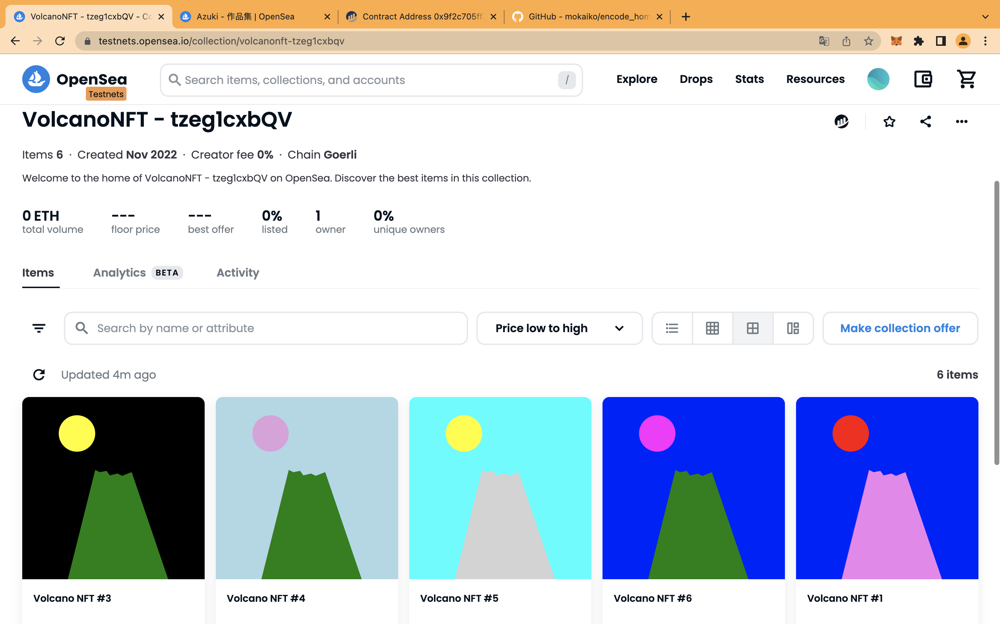
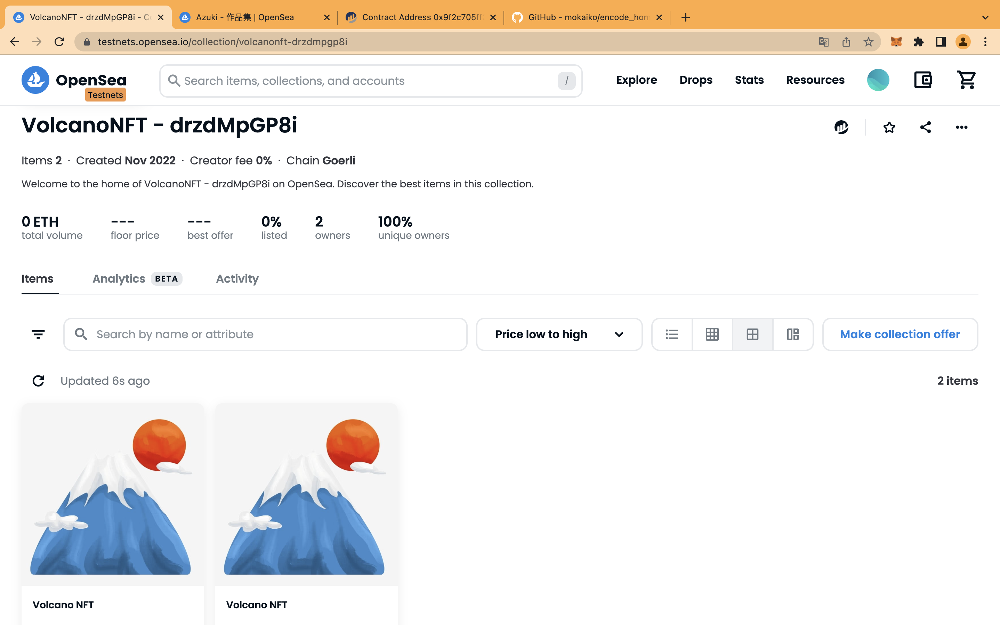

# [Foundry]

    ## Mint NFT, store the NFT Metadata on chain

    code: https://github.com/mokaiko/encode_homework/tree/volcanonft_foundry

    nft contract: https://goerli.etherscan.io/address/0x9f2C705fF34BA71a04F13e5ee1f0992E3bD012d9

    opensea: https://testnets.opensea.io/collection/volcanonft-tzeg1cxbqv

    

    ## Mint NFT, store the NFT Metadata on IPFS

    code: https://github.com/mokaiko/encode_homework/tree/volcanonft_foundry

    nft contract: https://goerli.etherscan.io/address/0x3b0fcf6175071595e52f4c156d3c69131cdbf6b5

    opensea: https://testnets.opensea.io/collection/volcanonft-drzdmpgp8i

    
